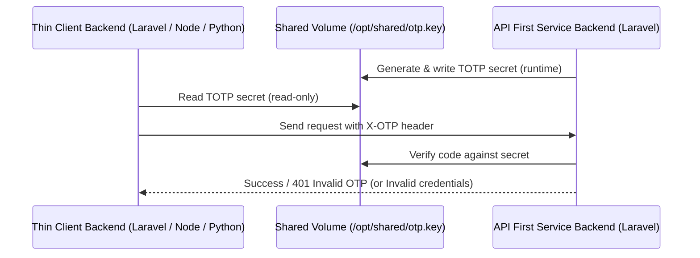

# Laravel API-First + Thin-Client Shared TOTP Handshake  
*for Docker / Podman ecosystems*

---

## 🧩 Overview
This repository demonstrates a **stateless, runtime-generated, shared-secret TOTP handshake pattern** for API-first and thin-client systems running within the same container host.  
It is framework-agnostic — while the example uses Laravel, the same logic works in Node, Python, Go, or any other environment that can compute an HMAC-based TOTP code.

---

## ⚙️ Architecture



---

## 🐳 Example Docker Setup

```yaml
services:
  api:
    image: laravel-api:latest
    volumes:
      - shared_otp:/opt/shared:rw
  fe:
    image: thin-client:latest
    volumes:
      - shared_otp:/opt/shared:ro

volumes:
  shared_otp:
```

The shared volume exists only while both containers are running.  
No persistent storage or environment variable is required — the API creates and rotates the key at runtime.

---

## 🧱 Laravel Example

Protect a route with the OTP middleware:

```php
Route::middleware(['verify.otp'])->post('/secure', function () {
    return response()->json(['success' => true]);
});
```

Rotate the key manually:

```
php artisan otp:rotate
```

---

## 🧱 A login with OTP Handshake Example

flowchart TD
    A([User: credentials + OTP]) --> B([User validation (password/token)])
    B -->|success| C([OTP verification - current key])
    B -->|failed| Z([Return: Invalid credentials])
    C -->|success| X([Login success])
    C -->|failed| D{Was key refreshed?}
    D -->|yes| Z
    D -->|no| E([FE: /api/keyrefresh request])
    E --> F([API: returns new key])
    F --> G([FE: retry OTP verification with new key])
    G -->|success| X
    G -->|failed| H([Log: OTP fail after refresh]) --> Z

    X:::success
    Z:::fail

    classDef success fill:#a2f4a2,stroke:#333,stroke-width:1px;
    classDef fail fill:#f9a2a2,stroke:#333,stroke-width:1px;

## 💡 Benefits

- **Stateless trust:** no Redis, database, or .env variables needed.  
- **Runtime secrets:** the API generates its shared secret dynamically at startup.  
- **Lightweight:** pure HMAC-SHA1 hashing (sub-microsecond per request).  
- **Language-agnostic:** any thin client can compute the same OTP code.  
- **Container-safe:** the key never leaves the internal Docker network.  
- **Performant:** faster than payload HMAC signatures or asymmetric auth.  
- **Ephemeral:** each container rebuild implicitly triggers a new secret.  
- **Auditable:** rotation and validation can be logged for traceability.  
- **Runtime secrets, no state, no infrastructure bloat:**  
  Unlike typical OTP or key-distribution systems, this pattern doesn’t rely on Redis, databases, or `.env` files.  
  The API creates the shared TOTP key at runtime, stores it inside a temporary volume, and re-generates it periodically.  
  The thin client reads the same key as needed — no network calls, no storage layer, no leak vector.

---

## 🔐 About the Shared Volume
The shared volume between API and thin client is **not a permanent key store** — it is only a **temporary synchronization buffer**.  
Either container may store its own copy internally.  
The API generates the key at runtime and writes it into the shared mount.  
Once the thin client reads the key, it may safely delete the file or detach the volume.  
This ensures that no persistent secret remains on disk, following ephemeral-container best practices.

---

## 🧠 Summary
This pattern provides a pragmatic, lightweight handshake mechanism for distributed microservices:
- secure, but infrastructure-free;  
- fast, but framework-independent;  
- auditable, but stateless.  

Ideal for systems where both API and client containers run on the same host, share minimal trusted state, and require simple, verifiable authenticity without complex PKI.

---

## 📄 License
MIT License — see [LICENSE](LICENSE)


